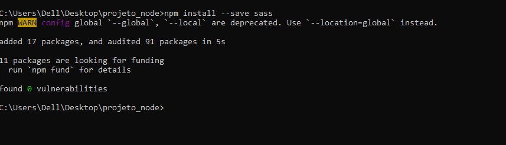
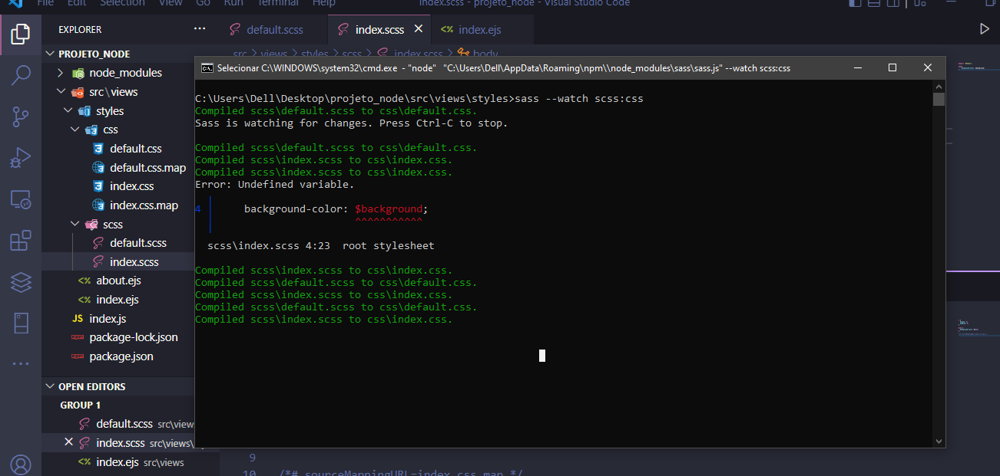
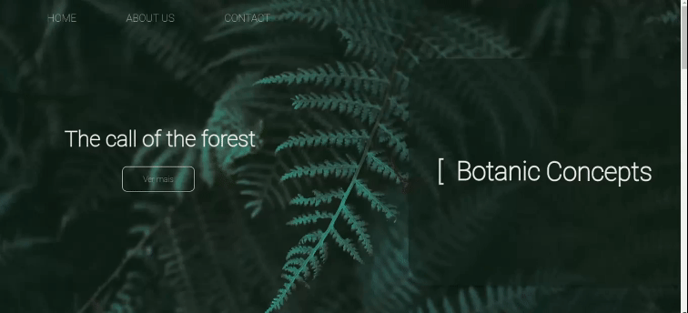

# Botanica-jardim
Reposito de um site para estudo de tecnologia de desenvolvimento web e web desing, baseado na ideia de um site de botânica, para exibição de plantas e abstração desta estética natural

## Utilização:

1. Clone o repositório:

```
git@github.com:MAIA332/Botanica-jardim.git
```

2. Certifique-se de possuir o nodejs instalado, você pode instala-lo pelo link: https://nodejs.org/en caso não possua ainda.

3. Certifique-se de possuir o saas (scss) instalado

```
npm install --g sass
```



3.1 Para edição dos estilos, será necessário inicializar o sass em suas pastas css e scss para que o mapeamento possa ser feito:

```
sass --watch scss:css
```



4. Execute o arquivo de execução correspondente ao seu sistema operacional.

4.1 Caso seja ```windows```:

```
inicializacao.bat
```

4.2 Caso seja ```Linux```:

```
inicializacao.sh
```

## Design:

### Home page:

